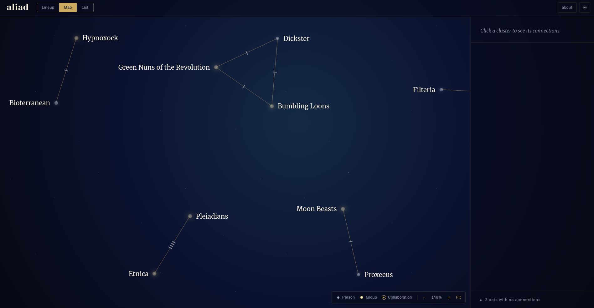

<p align="center">
  
</p>

<p align="center">
  <strong><a href="https://aliad.app">aliad.app</a></strong> — paste a festival lineup, find the acts playing more than once.
</p>

---

aliad is a tool for exploring aliases in a festival lineup. Given a list of
artists, it finds out which of those artists appear more than once in the
list under different names. The result is displayed as an interactive map
showing the connections between the acts.

<p align="center">
  
</p>

There are no accounts and no login. Artist data
comes from [MusicBrainz](https://musicbrainz.org) and
[Discogs](https://www.discogs.com).

## How it works

1. **You give it a lineup** by pasting it or sharing a link.
2. **It identifies the acts** from what you pasted or by reading them off the
   page you linked.
3. **It looks each one up** in MusicBrainz and Discogs.
4. **It maps the connections** visually and as a list.

In brief technical terms, it's a small serverless app with a vanilla-JS
frontend, backed by a graph database of the artist connections it has looked
up. Read more about it in **[ARCHITECTURE.md](./ARCHITECTURE.md)**.
[about.md](./about.md) has more information about what services are used to
process the submitted data.

## Running it yourself

```bash
npm install
npm run build:dev
npx wrangler dev          # full stack on http://localhost:8787
```

You'll need a `.dev.vars` file (gitignored) with `DISCOGS_TOKEN=…` (and
`OPENROUTER_API_KEY=…` if you want the LLM extraction layer). First run only:
`npx wrangler d1 migrations apply aliad-graph --local` to create the local
cache database. `npm run dev` alone serves the UI on :5173, but lookups need
the Worker. Details and deploy-time setup live in ARCHITECTURE.md.

Tests: `npm test` (Vitest), `npm run test:watch` for watch mode.

## License

[MIT](./LICENSE)
